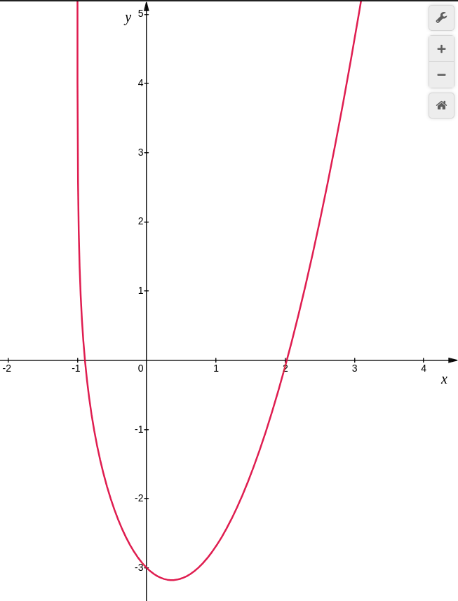

## Зміст

* TOC
{:toc}

## Мета

Розв'язати нелінійні рівняння та здійснити чисельне інтегрування функцій наближеними методами, використовуючи мови
функціонального програмування, lambda, let та set! форми.

## Завдання

1. Знайти корені нелінійного рівняння. Пошук наближеного значення хоча б одного кореня рівняння `f(x) = 0` здійснювати
    методами Ньютона та бісекцій. Початкове значення `x` обрати самостійно.

    

2. Написати процедури для обчислення інтеграла за формулами й методом трапецій. Порівняти результати обчислення.

    

## Мова та IDE

В якості мови програмування була обрана [racket](https://racket-lang.org/), оскільки вона є строго функціональною. В
якості середовища розробки було обрано супутній редактор DrRacket.

## Реалізація

### Задача 1

Для початку, побудуємо графік цільової функції. Він виглядає так:



Метод Ньютона (метод дотичних) - проста ітеративна процедура, яка намагається наблизити координати точки дотику до
точки перетину функції з віссю абсцис. Формульно це виглядає так:


Метод є нескладним, однак примхливим і не завжди результативним. Основний вплив на вирішення має початкова точка
процедури - вона задає не тільки вибір кореня, а й визначає можливість його обрахунку. Наприклад, в поточній задачі
рівняння має 2 корені, обмежену область визначення і "сліпу зону", де метод дотичних не повертає рішення.

```racket
(define (solve-neuton x)
  ; Метод Ньютона повертає корінь в залежності від початкової точки.
  (if
   ; І якщо ітераційна процедура виходить за область визначення ...
   (<= x -1)
   ; ... то результату немає.
   +nan.0
   ; Однак, допоки значення функції в точці можна обрахувати ...
   (let
      ((f (evaluate x)))
    (if
     ; ... то при достатньому наближенні до 0 ...
     (< (abs f) 1e-9)
     ; ... один з коренів буде отриманий.
     x
     ; А поки рішення не зійшлося, обраховуємо похідну й оновлюємо абсцису дотику.
     (solve-neuton (- x (/ f (- (* 2 x) (/ 1 (+ x 1))))))))))

(define (evaluate x)
  ; Вираз для обчислення нелінійної функції в точці.
  (- (sqr x) (log (+ x 1)) 3))
```

Давайте ж поглянемо, як на результат впливає початкова координата. В тих випадках, де провести дотичну неможливо,
функція повертає `nan`.

```racket
> (solve-neuton -10)
+nan.0
> (solve-neuton -0.99)
-0.8900574880065422
> (solve-neuton -0.85)
-0.8900574880065492
> (solve-neuton 0)
+nan.0
> (solve-neuton 0.3)
+nan.0
> (solve-neuton 2.2)
2.0266892633235543
> (solve-neuton 18)
2.0266892632569267
```

Ще один спосіб вирішення нелінійних рівнянь - метод бісекцій. Його природа проста: на початку обирається проміжок
`[a, b]`, а потім на кожному кроці обраховуються значення функцій `f(a)`, `f(x)` i `f(b)`, де `x = (a + b) / 2`. Якщо
`f(x) = 0`, то `x` вважається розв'язком рівняння. Інакше ж здійснюється рекурсивний перехід до одного з проміжків
`[a, x]` чи `[x, b]`, вибір якого здійснюється при відмінності знаків значень функції на кінцях. Головним недоліком
методу є те, що результат роботи залежить від того, чи вгадав дослідник з межами й включив рішення в початкові межі.

```racket
(define (solve-bisection a b)
  ; Метод бісекцій потребує ліву й праву межу, посеред яких шукаються корені.
  (if
   ; Якщо дані виходять за межі області визначення ...
   (<= a -1)
   ; ... то результату немає.
   +nan.0
   (let
       ; Обчислюємо координати середини проміжку.
       ((x (/ (+ a b) 2))
        ; Обчислюємо функцію у лівій межі.
        (l (evaluate a))
        ; Обчислюємо функцію посередині.
        (m (evaluate (/ (+ a b) 2)))
        ; Обчислюємо функцію у правій межі.
        (r (evaluate b)))
     (cond
       ; Якщо вдалося наблизитися до нуля - повертаємо координату.
       ((< (abs m) 1e-9) (exact->inexact x))
       ; При відмінності знаків беремо лівий напівпроміжок.
       ((not (= (sgn l) (sgn m))) (solve-bisection a x))
       ; При відмінності знаків беремо лівий напівпроміжок.
       ((not (= (sgn m) (sgn r))) (solve-bisection x b))
       ; Якщо проміжків з відмінними знаками нема - рішення нема.
       (else +nan.0)))))
```

Давайте ж поглянемо, як на результат впливає початковий проміжок. В тих випадках, де перетину з віссю ординат, функція
повертає `nan`.

```racket
> (solve-bisection 0 7)
2.0266892631188966
> (solve-bisection -0.92 2.5)
-0.890057488065213
> (solve-bisection -2 7)
+nan.0
> (solve-bisection -1 1)
+nan.0
> (solve-bisection -0.99 0)
-0.8900574880675414
```

Результати двох методів обрахунку відрізняються лише на 7+ знаку після коми. Можна стверджувати, що обидва способи
еквівалентно влучні. Недолік обох підходів - залежність від початкових даних і розуміння характеру функції. Тому
не рекомендував би їх для тих задач, де природа нелінійного рівняння є важкою для візуалізації.

### Задача 2

Аналітично заданий інтеграл спрощується до такої первісної:


Якщо ж вирішувати його чисельно, з допомогою методу трапецій:


То неодмінно зіштовхнемося з проблемою підбору оптимального числа трапецій.

```racket
(define (integrate-symbol)
  ; Дана первісна була виведена аналітично з підінтегрального виразу.
  (define (integrate x)
    (* (/ x 2) (sqrt (+ (sqr x) 1))))
  ; За формулою Ньютона-Лейбніца знаходимо площу під кривою.
  (- (integrate 1.6) (integrate 0.5)))

(define (integrate-trapezoid n)
  ; Дана рекурсія обраховує суму площ трапецій, допоки не перебере їх усі.
  (define (integrate xi0 xi1 xn sum)
    (if
     ; Якщо "ліва" основа трапеції достатньо порівнялася з кінцем проміжку ...
     (<= (abs (- xn xi0)) 1e-6)
     ; ... то накопичену суму можна вважати розв'язком.
     sum
     ; Інакше ж продовжуємо ходу.
     (integrate
      ; "Права" основа трапеції буде "лівою".
      xi1
      ; До неї ж додамо крок інтегрування, це буде нова "права" основа.
      (- (* 2 xi1) xi0)
      ; Незмінною залишається межа
      xn
      ; А сума збільшується на площу поточної трапеції. Її висота - різниця абсцис, середня
      ; лінія - півсума ординат, а площа - добуток цих виразів.
      (+ sum (* (- xi1 xi0) (/ (+ (estimate xi0) (estimate xi1)) 2))))))
  ; Задаємо формулу підінтегрального виразу.
  (define (estimate x)
    (/ (+ (sqr x) 0.5) (sqrt (+ (sqr x) 1))))
  ; Вказуємо нижню й верхню межу інтегрування.
  (let
      ((a 0.5)
       (b 1.6))
    ; На початку визначаємо крок h i нульову суму.
    (integrate a (+ a (/ (- b a) n)) b 0)))
```

Ось така точність для аналітичного й чисельного рішення:

```racket
> (integrate-symbol)
1.2299284839415832
> (integrate-trapezoid 1)
1.2609394323128174
> (integrate-trapezoid 5)
1.2312986762065945
> (integrate-trapezoid 50)
1.229942237101614
> (integrate-trapezoid 400)
1.2299286988426172
```

Влучність чисельного рішення наближається до аналітичного при поділі на сотні трапецій.

## Висновки

Обчислювальні методи - один з небагатьох доступних способів за притомний час розв'язати ту чи іншу нелінійну задачу.
І функціональні мови дуже успішні на цьому поприщі, вони надають багатий функціонал для операцій над послідовностями
й ітеративними процедурами. В той же час, оператори присвоювання в межах власного контексту спрощують і скорочують
код, адже сприяють перевикористанню вже набутих значень.
